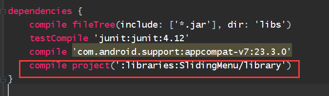

#详细介绍如何导入slidingmenu库
 1. 到Github上下载slidingmenu的压缩包[https://github.com/jfeinstein10/SlidingMenu](https://github.com/jfeinstein10/SlidingMenu)
 2. 解压得到 SlidingMenu文件（这里修改了文件的名称 解压出来的原文件名为  **SlidingMenu-master**，修改名称是为了方便后面的步骤）
 3. 在项目的根目录下创建一个文件夹 libraries
 	  
	
 4. 将刚才解压的文件全部复制到该文件夹下
 
	
 5. 在文件setting.gradle中添加一条  
    >include ':app',':libraries:SlidingMenu/library'
    
	
 
 6. 在app 目录下的文件build.gradle中  dependencies 内添加一条
 	>compile project(':libraries:SlidingMenu/library') 
 	
	
	
 7. 比较关键的一步
进入 libraries-->slidingmenu-->library-->build.gradle中 参照APP文件夹的build.gradle文件修改 
compileSdkVersion  buildToolsVersion  minSdkVersion targetSdkVersion  V4包 的版本号
	
	
8. 菜单栏  Build-->Make Project 这样就可以使用Slidingmenu了
可能或报一个错误 使用了FloatMath类的缘故，该类已不存在直接使用Math即可。

##说明
此用法也可以适用于其他的第三方库如[**pull-to-reflash**](https://github.com/liaohuqiu/android-Ultra-Pull-To-Refresh)
##参考资料
文章 ：[http://stackoverflow.com/questions/19079072/how-to-import-slidingmenu-on-android-studio](http://stackoverflow.com/questions/19079072/how-to-import-slidingmenu-on-android-studio)
